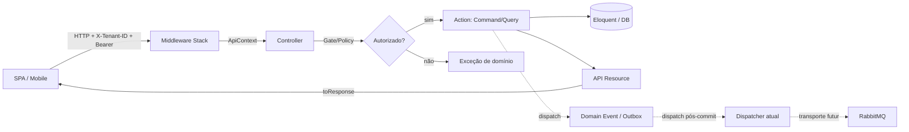

# Visão de Arquitetura

## Intenção

Plataforma EAD multi-tenant **API-first**, reconstrução do sistema legado `eadIA` com
arquitetura RESTful pura. O backend não renderiza interface: serve uma API JSON consumida
por SPAs e apps mobile. O foco é isolamento entre tenants, regras de negócio testáveis e
extensibilidade via plugins.

## Stack Tecnológica

- PHP 8.4 + Laravel 12 (estrutura streamlined; sem `app/Http/Kernel.php`)
- Laravel Sanctum (autenticação por token opaco)
- spatie/laravel-permission (RBAC)
- spatie/laravel-multitenancy (resolução/escopo de tenant)
- MySQL 8.0 / MariaDB (estatísticas) / Redis (cache); RabbitMQ é transporte assíncrono diferido
- Pest 4 (testes)
- Scribe (documentação de API)

## Princípios

1. **Action Layer** — regra de negócio vive em
   `app/Modules/<Module>/Actions/<Resource>/...`.
   Controllers apenas orquestram request → autorização → action → resource.
2. **Autorização por endpoint** — todo método de controller valida Gate/Policy antes da Action.
3. **ApiContext** — Value Object (`$user` + `$tenant`) injetado por middleware; controllers e
   actions nunca acessam tenant/user direto do request.
4. **API Resources sempre** — nunca arrays crus em respostas.
5. **TDD** — todo comportamento coberto por teste (Pest).

## Camadas e Lifecycle de Requisição

Sequência canônica: **Route → Middleware (resolve tenant, ApiContext) → Controller → Gate/Policy
→ Action → Eloquent → Resource → Response**. Eventos são registrados/despachados pelas Actions;
efeitos críticos usam outbox e dispatcher pós-commit atual. RabbitMQ é alvo de transporte assíncrono,
não fato operacional atual (ver `performance-scalability.md`).

## Módulos de domínio e áreas API

O layout executável atual e canônico é o monólito modular de cinco módulos:
`Core`, `Learning`, `Assessment`, `Financial` e `Ecosystem`, com o shared kernel em `app/Shared`.
Costuras plugáveis pertencem aos módulos que as possuem: gateways em `Financial`, contratos e
configuração de plugins em `Ecosystem`, e o futuro `MediaProvider` não cria um namespace legado.
`app/Plugins` e `app/Support/Ports` são paths históricos/superseded e não são alternativas para
trabalho novo. A dívida Eloquent cross-module existente, congelada em allowlist, permanece dívida;
esta decisão não autoriza refactor nem a apresenta como resolvida.

Domínios limitados organizam ownership de código; não definem prefixo público de URL. Rotas de
produto seguem `/api/v1/{area}/{resource}`. Mapa de personas, contratos de área e migração dos
endpoints legado: [Áreas & Superfícies](areas-surfaces.md). Roadmap de jornadas:
[`docs/ROADMAP.md`](../../ROADMAP.md).

| # | Módulo | Responsabilidade |
|---|--------|------------------|
| 10 | Core & Identity | Auth, usuários, tenants, configuração white-label |
| 20 | Catalog & Learning | Catálogo, cursos/módulos/aulas, matrículas, progresso, mídia, ratings |
| 30 | Assessment | Questionários, questões, tentativas, certificados |
| 40 | Financial | Orders, payments, webhooks de gateway |
| 50 | Ecosystem & Plugins | Capabilities, configuração de plugins, marketplace e billing recorrente |

## Fronteiras cross-domain

Domínios comunicam por **eventos de domínio ou Contracts públicos**, nunca por Models, Actions ou
internals de outro módulo. Financial→Ecosystem já prova Contract público: Financial resolve gateway
via `Ecosystem\Contracts\TenantGatewayProvider`, sem importar model Ecosystem. Exemplos:

- `OrderPaidEvent` (Financial) → Learning escuta e dispara matrícula automática (`EnrollService`).
- `LessonCompletedEvent` (Learning) → recalcula progresso e pode engatilhar emissão de certificado (Assessment).
- Ativação/expiração de plugin (Ecosystem) → invalida cache de features do tenant.

Nomes de eventos vivem em `## Events` da `spec.md`; Contracts públicos ficam no namespace
`Contracts` do módulo dono. Transporte futuro (RabbitMQ, MariaDB de stats) vive em
`performance-scalability.md`.

## Legado eadIA (fonte de referência)

O projeto `eadIA` em `/home/paulo/www/eadIA` (49 models, 97 migrations, 5 painéis Filament,
140+ testes) é a **referência de regras de negócio e estrutura de dados**. Não é código a
portar literalmente — é fonte de verdade sobre o domínio. Ver `glossary.md`.
