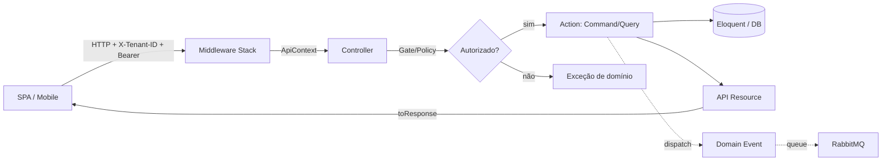

# Visão de Arquitetura

## Intenção

Plataforma EAD multi-tenant **API-first**, reconstrução do sistema legado `eadIA` com
arquitetura RESTful pura. O backend não renderiza interface: serve uma API JSON consumida
por SPAs e apps mobile. O foco é isolamento entre tenants, regras de negócio testáveis e
extensibilidade via plugins.

## Stack Tecnológica

- PHP 8.4 + Laravel 12 (estrutura streamlined; sem `app/Http/Kernel.php`)
- Laravel Sanctum (autenticação por token opaco)
- spatie/laravel-permission (RBAC)
- spatie/laravel-multitenancy (resolução/escopo de tenant)
- MySQL 8.0 / MariaDB (estatísticas) / Redis (cache) / RabbitMQ (filas de eventos)
- Pest 4 (testes)
- Scribe (documentação de API)

## Princípios

1. **Action Layer** — regra de negócio vive em `app/Actions/<Domain>/<Resource>/...`.
   Controllers apenas orquestram request → autorização → action → resource.
2. **Autorização por endpoint** — todo método de controller valida Gate/Policy antes da Action.
3. **ApiContext** — Value Object (`$user` + `$tenant`) injetado por middleware; controllers e
   actions nunca acessam tenant/user direto do request.
4. **API Resources sempre** — nunca arrays crus em respostas.
5. **TDD** — todo comportamento coberto por teste (Pest).

## Camadas e Lifecycle de Requisição

Sequência canônica: **Route → Middleware (resolve tenant, ApiContext) → Controller → Gate/Policy
→ Action → Eloquent → Resource → Response**. Eventos de domínio são despachados pelas Actions e
processados de forma assíncrona (ver `performance-scalability.md`).

## Mapa de Domínios

| # | Domínio | Base URL | Responsabilidade |
|---|---------|----------|------------------|
| 10 | Core & Identity | `api/v1/core` | Auth, usuários, tenants, configuração white-label |
| 20 | Catalog & Learning | `api/v1/learning` | Catálogo, cursos/módulos/aulas, matrículas, progresso, mídia, ratings |
| 30 | Assessment | `api/v1/assessment` | Questionários, questões, tentativas, certificados |
| 40 | Financial | `api/v1/financial` | Orders, payments, webhooks de gateway |
| 50 | Ecosystem & Plugins | `api/v1/ecosystem` | Marketplace de plugins, assinaturas SaaS, billing recorrente |

## Boundaries de Evento (cross-domain)

Domínios se comunicam por **eventos de domínio**, nunca por chamadas diretas a código de outro
domínio. Exemplos de contratos:

- `OrderPaidEvent` (Financial) → Learning escuta e dispara matrícula automática (`EnrollService`).
- `LessonCompletedEvent` (Learning) → recalcula progresso e pode engatilhar emissão de certificado (Assessment).
- Ativação/expiração de plugin (Ecosystem) → invalida cache de features do tenant.

Os nomes de eventos vivem na seção `## Events` da `spec.md` de cada domínio; a mecânica de
transporte (RabbitMQ, MariaDB de stats) vive em `performance-scalability.md`.

## Legado eadIA (fonte de referência)

O projeto `eadIA` em `/home/paulo/www/eadIA` (49 models, 97 migrations, 5 painéis Filament,
140+ testes) é a **referência de regras de negócio e estrutura de dados**. Não é código a
portar literalmente — é fonte de verdade sobre o domínio. Ver `glossary.md`.
